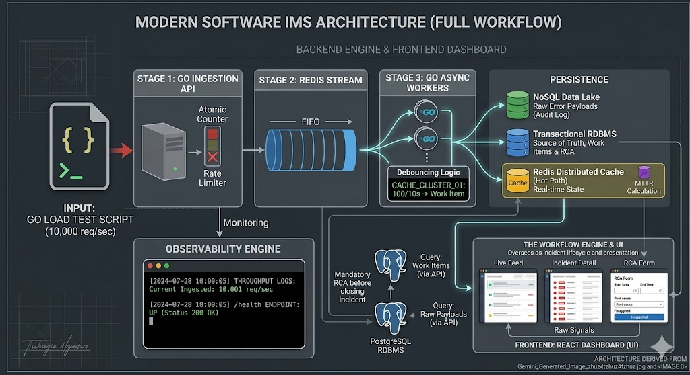

# Zeotap Incident Management System (IMS)

A mission-critical, high-throughput Incident Management System designed to ingest, debounce, and process high volumes of distributed system signals — errors, latency spikes, and events — in real time.

Built to safely handle massive traffic bursts of up to **10,000+ signals/sec**, deduplicate identical alerts using a **sliding-window debouncer**, and surface everything through a **human-in-the-loop React dashboard** for Root Cause Analysis (RCA) and MTTR tracking.

---

## Table of Contents

- [Tech Stack](#tech-stack)
- [Architecture](#architecture)
- [Backpressure & Concurrency](#backpressure--concurrency)
- [Getting Started](#getting-started)
- [Testing & Mock Data](#testing--mock-data)
- [Analytics & Metrics](#analytics--metrics)

---

## Tech Stack

| Layer                | Technology                                    |
| -------------------- | --------------------------------------------- |
| **Backend**          | Go (Golang) 1.22+, Gin Framework              |
| **Frontend**         | React, Vite, TailwindCSS                      |
| **Ingestion Buffer** | Redis Streams, Debounce Locks, Hot-Path Cache |
| **Raw Signal Store** | MongoDB (schema-less, forensic audit log)     |
| **Source of Truth**  | PostgreSQL (ACID-compliant, relational)       |
| **Infrastructure**   | Docker, Docker Compose, Nginx                 |

---

## Architecture



The system is heavily decoupled into distinct microservices and persistence layers to ensure fault isolation and prevent bottlenecks.

### Components

**1. Ingestion API (Go)**
A lightweight, non-blocking HTTP server that validates incoming JSON payloads and pushes them into an in-memory buffer channel before returning immediately to the caller.

**2. Message Queue (Redis Streams)**
Acts as an asynchronous FIFO buffer to completely decouple ingestion from downstream database latency. The ingestion layer never waits on persistence.

**3. Processing Workers (Go)**
Consumer groups that read from Redis Streams, execute the 10-second sliding-window debouncing logic, and route data to the appropriate storage sinks.

**4. Data Lake (MongoDB)**
An append-only NoSQL store that captures every raw signal payload for forensic audit logging and retrospective analysis.

**5. Source of Truth (PostgreSQL)**
A transactional RDBMS storing aggregated Work Items, state transition history, and mandatory RCA records.

**6. Hot-Path Cache (Redis)**
Maintains real-time Live Dashboard state for sub-10ms UI rendering — no database hit on every page refresh.

**7. Frontend (React + Tailwind)**
A high-density, dark-mode command center for SREs to monitor the live signal feed, investigate raw payloads, and close incidents with RCA documentation.

---

## Backpressure & Concurrency

A core design requirement was ensuring the system **does not crash** when the persistence layer becomes slow or unavailable. This is addressed through a multi-layered backpressure strategy.

### Token-Bucket Rate Limiter

The ingestion API is protected by a strict rate limiter. Traffic exceeding the configured threshold is rejected with `HTTP 429 Too Many Requests`, forcing clients to rely on exponential backoff rather than overwhelming the server.

### Payload Batching

To bypass Docker's userland proxy NAT bottlenecks at high concurrency, the API accepts batches of signals (e.g. arrays of 500 signals per request). This drastically reduces TCP handshakes and network overhead.

### The "Shock Absorber" — Go Channel Buffer

Before touching Redis, HTTP handlers drop valid signals into a **fixed-capacity (50,000) Go Channel** and return `HTTP 202 Accepted` immediately. If Redis experiences a latency spike, the channel absorbs the load without blocking the HTTP layer.

### Fail-Fast Memory Protection

If the Go Channel fills to capacity (e.g. Redis goes completely offline), the API instantly returns `HTTP 503 Service Unavailable`. This prevents the Go runtime from infinitely allocating memory and crashing via OOM (Out of Memory).

### Controlled Connection Pools

A fixed pool of Go Worker Goroutines drains the channel and pushes to Redis, strictly controlling the number of concurrent database connections and preventing connection exhaustion.

---

## Getting Started

The entire infrastructure and application stack is containerized. No manual dependency installation is required.

### Prerequisites

- [Docker](https://docs.docker.com/get-docker/) & Docker Compose
- Git

### Installation

**1. Clone the repository**

```bash
git clone https://github.com/tf-vishal/zeotap-ims.git
cd zeotap-ims
```

**2. Configure environment variables**

A sample environment file is provided for local testing.

```bash
cp .env.example .env
```

**3. Start the stack**

```bash
docker compose up -d --build
```

**4. Verify all containers are running**

```bash
docker compose ps
```

Once all services are healthy, the dashboard will be available at `http://localhost` (or as configured in your `.env`).

---

## Testing & Mock Data

Built-in Go load testers are provided to prove the system handles 10,000+ signals/sec and correctly debounces event floods.

Navigate to the `scripts/` directory and choose :

### High-Throughput Load Test

Fires **10,000 signals** across 10 distinct components concurrently.

```bash
./run_10k_load.sh
```

**Change value in `scripts/run_10k_load.sh` if you want to change the number of signals or concurrency or batch size**

## Analytics & Metrics

| Feature                | Description                                                             |
| ---------------------- | ----------------------------------------------------------------------- |
| **Throughput Logging** | Backend prints `signals/sec` to the console every 5 seconds             |
| **MTTR Tracking**      | A background aggregator continuously calculates Mean Time To Resolution |
| **Incident Workflow**  | Strict state machine: `OPEN → INVESTIGATING → RESOLVED → CLOSED`        |
| **RCA Enforcement**    | The system rejects closure attempts if the RCA payload is missing       |

## Additional Enhancements & Creative Add-ons

Beyond the core requirements, several performance and usability improvements were implemented to push the system further.

### Performance Optimization

Payload batching allows the ingestion API to process up to **50,000 signals/sec** — 5× the baseline requirement. By accepting arrays of signals per HTTP request, the system dramatically reduces TCP handshake overhead and saturates throughput without increasing infrastructure cost.

### UI Improvements

The dashboard goes beyond basic requirements with a high-density, dark-mode SRE command center built in React + Tailwind — designed for real operational use rather than just functional display.

### Better Observability

Live infrastructure health indicators on the dashboard show the real-time status of each backing service (Redis, MongoDB, PostgreSQL) as explicitly **UP** or **DOWN**, giving operators immediate visibility into dependency failures without needing to check logs or external tooling.

### Smarter Rate Limiting

A **token-bucket rate limiter** is used instead of a simple counter. This allows short bursts of legitimate traffic while still enforcing sustained throughput limits — reducing false rejections during transient spikes compared to fixed-window approaches.

### Go Channel as Pre-Redis Buffer

An in-memory **Go Channel (capacity: 50,000)** sits between the HTTP ingestion layer and Redis Streams. HTTP handlers write to the channel and return `202 Accepted` immediately, fully decoupling API response time from Redis latency. This also acts as a natural circuit breaker — if Redis goes offline, the channel fills and the API begins returning `503` before any memory pressure builds up.
